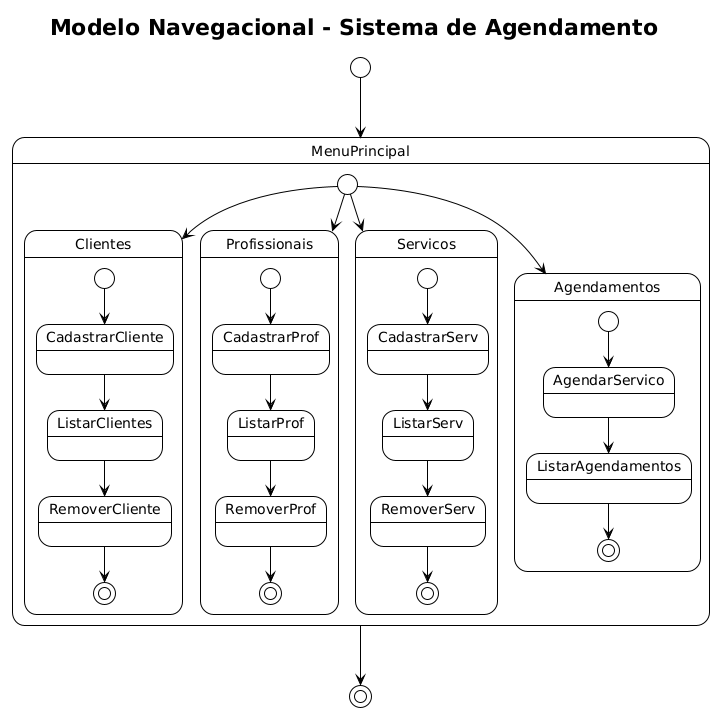
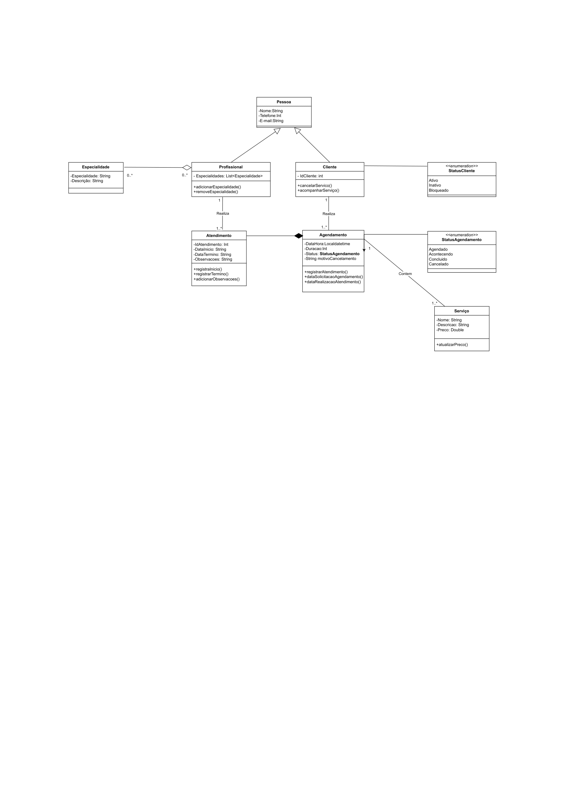

# Sistema de Agendamento de Serviços em Salão de Beleza

## Funcionalidades Implementadas
- Cadastro de Clientes, Profissionais e Serviços
- Agendamento

## Estrutura
- `models`: classes de domínio
- `repository`: dados em memória
- `controller`: regras de negócio
- `view`: menus no terminal

## Executar
Compile e rode a classe `Main.java` (a criar no final)

## Requisitos
Java 17+ ou superior

## Integrantes do grupo com nome completo
* Rafael Varela Joachim Queimado - rafael.queimado@ufrpe.br
* João Victor Vasconcelos Ferraz - joao.victorferraz@ufrpe.br
* Ana Nínive Ribeiro de Oliveira - ana.ninive@ufrpe.br
* Bruno Leonardo Assis Pimentel - bruno.assis@ufrpe.br

## Modelo Navegacional

## Diagrama de Classes

## Descrição

Este sistema tem como objetivo gerenciar o agendamento de serviços em um salão de beleza, facilitando o controle de horários, profissionais, clientes e serviços oferecidos. O sistema permite o cadastro dos profissionais com suas especialidades, clientes com seus dados pessoais, e serviços disponíveis com duração e preço.

Os clientes podem agendar horários para diferentes serviços, escolhendo o profissional desejado quando aplicável. O sistema controla conflitos de horários, gerencia o status dos atendimentos (agendado, em andamento, concluído, cancelado) e possibilita o reagendamento ou cancelamento, respeitando regras de antecedência.

Além disso, o sistema gera relatórios sobre atendimentos realizados, horários mais procurados, e produtividade dos profissionais, com possibilidade de exportação em PDF ou CSV.

## Requisitos Funcionais

### 1. Gerenciamento de Profissionais e Serviços

- **REQ01**: Permitir cadastro e manutenção de profissionais, incluindo nome, especialidades, telefone e e-mail.
- **REQ02**: Permitir cadastro e gerenciamento dos serviços oferecidos, incluindo nome, descrição, duração padrão e preço.

### 2. Gerenciamento de Clientes

- **REQ03**: Permitir cadastro de clientes com nome, telefone, e-mail e histórico de agendamentos.
- **REQ04**: Controlar status do cliente (ativo, inativo, bloqueado).

### 3. Agendamento de Serviços

- **REQ05**: Permitir que clientes agendem um ou mais serviços, escolhendo profissional (quando aplicável) e horário disponível.
- **REQ06**: Impedir agendamento em horários já ocupados pelo profissional selecionado ou pela sala (quando houver).
- **REQ07**: Permitir agendamento de serviços consecutivos, respeitando a duração total.

### 4. Gerenciamento de Agenda

- **REQ08**: Permitir visualização da agenda diária/semanal por profissional, por cliente ou por sala.
- **REQ09**: Permitir alteração e cancelamento de agendamentos respeitando regras de antecedência (ex: cancelamento até 24h antes).
- **REQ10**: Registrar motivo de cancelamento e histórico de alterações nos agendamentos.

### 5. Atendimento

- **REQ11**: Registrar início e término do atendimento, com status (em andamento, concluído).
- **REQ12**: Permitir observações e comentários do profissional sobre o atendimento.

### 6. Notificações e Lembretes

- **REQ13**: Enviar notificações automáticas para clientes sobre agendamentos, alterações e cancelamentos (simulação ou e-mail).
- **REQ14**: Enviar lembretes automáticos para clientes no dia anterior ao atendimento (simulação ou e-mail).

### 7. Relatórios e Estatísticas

- **REQ15**: Gerar relatórios de agendamentos por período, profissional, cliente e serviço.
- **REQ16**: Apresentar estatísticas sobre serviços mais procurados e horários de maior demanda.
- **REQ17**: Permitir exportação dos relatórios em **PDF** e **CSV**, com filtros e agrupamentos.

### 8. Regras e Restrições

- **REQ18**: Não permitir agendamento para horários passados.
- **REQ19**: Permitir cancelamento apenas até um período limite antes do horário agendado.
- **REQ20**: Bloquear clientes com histórico de cancelamentos frequentes de realizar novos agendamentos temporariamente.
- **REQ21**: Garantir que um profissional não tenha agendamentos sobrepostos.

## Possíveis APIs/Bibliotecas a Serem Usadas

- **JavaFX** – Interface para cadastro, agenda e visualização.
- **JDBC / Hibernate** – Persistência e consultas ao banco de dados.
- **Java Time API** – Controle de datas, horários e validação de agendamentos.
- **iText / JasperReports** – Geração de relatórios em PDF.
- **Apache POI** – Exportação de dados em formato CSV ou Excel.
- **JUnit / Mockito** – Testes automatizados para regras de negócio de agendamento e cancelamento.
